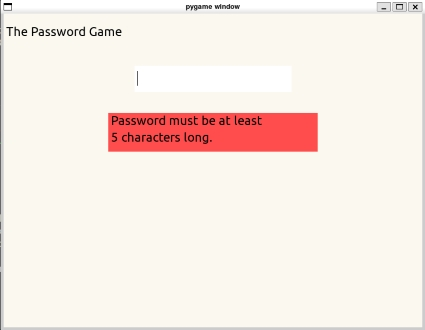
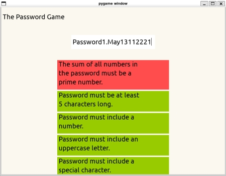
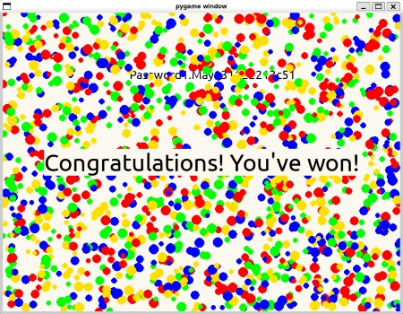

# The Password Game
By Arman Ozsu, Kristin Xu, and Luke Zahner at Olin College

## What's The Password Game?
"The Password Game" is a fun and interactive game that challenges players to create a password that satisfies a complex and increasingly ridiculous set of rules. We built it using the model-view-controller architecture. The goal is to satisfy all the quirky requirements, including integration of elements like roman numerals, Fibonacci sequence, and even Morse code, which triggers a celebration sequence once all criteria are met! Notable aspects about the game include that it provides real-time feedback and animations, has a unique set or rules/requirements, and prohibits inappropriate word entry.



## How to Install
To get started with "The Password Game", clone our [GitHub repository](https://github.com/olincollege/passwordgame.git "GitHub Link") containing all the necessary files:

```
git clone https://github.com/olincollege/passwordgame.git
```

After cloning the repository, ensure Python and the required libraries (pygame, sympy, better_profanity) are installed using the following commands:

```
pip install pygame
pip install sympy
pip install better_profanity
```

To launch the game, navigate to the directory where the files are located and run the following command:

```
python main.py
```



#### Congratulations, you can now play the game! Have fun and Good luck!

## Credit
We would like to acknowledge and thank the creators of the original password game concept, which inspired us to develop this interactive version. After playing our game, check out their original version [here](https://neal.fun/password-game/here! "Game Link") built by Neal Agarwal. Check out his portfolio website [here](https://nealagarwal.me/! "Site Link"). His idea inspired us and motivated us to explore complex programming concepts and engage with an audience in a fun and interactive manner. 

